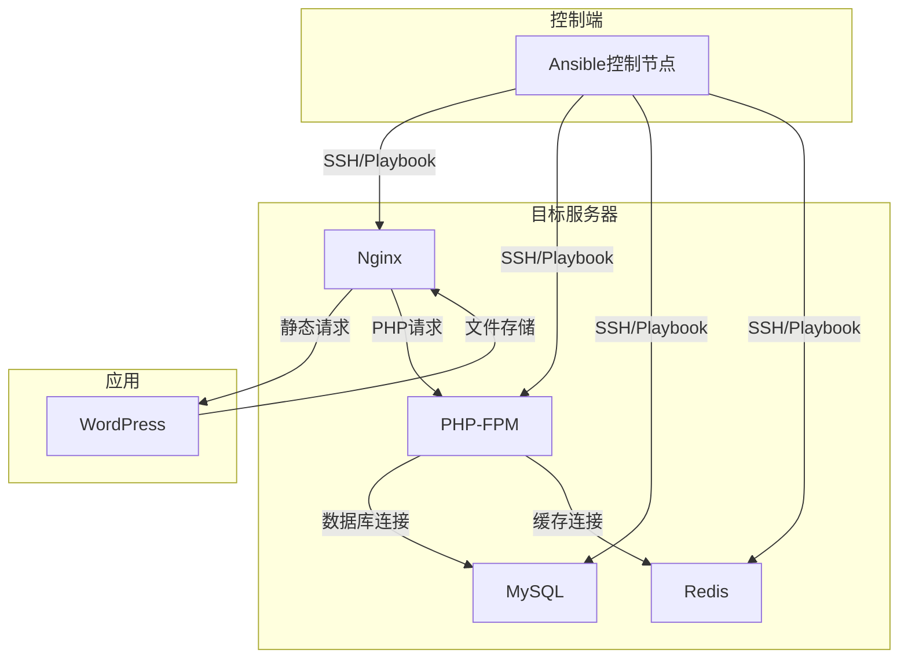

# Ansible自动化部署基于LNMP+Redis的WordPress论坛

---

## 一、项目架构

### 1.1 整体架构图



### 1.2 服务器节点规划

| 节点角色   | 主机名           | IP地址示例          | 部署组件    | 备注              |
| ------ | ------------- | --------------- | ------- | --------------- |
| 控制节点   | `ansible.com` | 192.168.227.200 | Ansible | 仅用于管理，不部署业务服务   |
| Web服务器 | `nginx.com`   | 192.168.227.11  | Nginx   | 处理静态资源          |
| PHP服务器 | `php.com`     | 192.168.227.12  | PHP-FPM | 解析 PHP 脚本       |
| 数据库服务器 | `mysql.com`   | 192.168.227.13  | MySQL   | 存储 WordPress 数据 |
| 缓存服务器  | `redis.com`   | 192.168.227.14  | Redis   | 缓存提升响应速度        |

### 1.3软件版本清单

- **操作系统** :`CentOS7.7.1908`

- **Ansible** :2.9.27

- **Nginx**:1.28.3

- **Mysql**:8.0.45

- **PHP**：8.0.30

- **Redis**:7.2.4

- **WordPress**:5.6.6

## 二、环境准备

### 2.1 控制主机

```bash
#配置yum源
rm -rf /etc/yum.repos.d/*
cat > /etc/yum.repos.d/CentOS-Base.repo << EOF
[base]
name=CentOS-$releasever - Base - mirrors.aliyun.com
failovermethod=priority
baseurl=http://mirrors.aliyun.com/centos/$releasever/os/$basearch/
gpgcheck=1
gpgkey=http://mirrors.aliyun.com/centos/RPM-GPG-KEY-CentOS-7

#released updates 
[updates]
name=CentOS-$releasever - Updates - mirrors.aliyun.com
failovermethod=priority
baseurl=http://mirrors.aliyun.com/centos/$releasever/updates/$basearch/
gpgcheck=1
gpgkey=http://mirrors.aliyun.com/centos/RPM-GPG-KEY-CentOS-7

#additional packages that may be useful
[extras]
name=CentOS-$releasever - Extras - mirrors.aliyun.com
failovermethod=priority
baseurl=http://mirrors.aliyun.com/centos/$releasever/extras/$basearch/
gpgcheck=1
gpgkey=http://mirrors.aliyun.com/centos/RPM-GPG-KEY-CentOS-7
EOF
yum clean all
yum makecache

#配置IP地址
cat > /etc/sysconfig/network-scripts/ifcfg-ens33 << EOF
TYPE=Ethernet
DEVICE=ens33
NAME=ens33
BOOTPROTO=static
ONBOOT=yes
IPADDR=192.168.227.100
PREFIX=24
GATEWAY=192.168.227.2
DNS1=114.114.114.114
EOF
systemctl restart network

#配置主机名及域名解析
hostnamectl set-hostname ansible.com
cat >> /etc/hosts << EOF
192.168.227.100 ansible.com ansible
192.168.227.11  nginx.com   nginx
192.168.227.12  php.com     php
192.168.227.13  mysql.com   mysql
192.168.227.14  redis.com   redis
EOF

#关闭防火墙
systemctl stop firewalld
systemctl disable firewalld

#关闭selinux
setenforce 0
sed -i 's/SELINUX=enforcing/SELINUX=disabled/' /etc/selinux/congfig
```

### 2.2 目标主机

> 以nginx主机为例

```bash
#配置IP地址
cat > /etc/sysconfig/network-scripts/ifcfg-ens33 << EOF
TYPE=Ethernet
DEVICE=ens33
NAME=ens33
BOOTPROTO=static
ONBOOT=yes
IPADDR=192.168.227.11
PREFIX=24
GATEWAY=192.168.227.2
DNS1=114.114.114.114
EOF
systemctl restart network

#配置主机名
hostnamectl set-hostname nginx.com
```

### 2.3 控制节点配置SSH免密登录

```bash
yum install -y sshpass
ssh-keygen
sshpass -p '123' ssh-copy-id -o StrictHostKeyChecking=no root@nginx
sshpass -p '123' ssh-copy-id -o StrictHostKeyChecking=no root@mysql
sshpass -p '123' ssh-copy-id -o StrictHostKeyChecking=no root@redis
sshpass -p '123' ssh-copy-id -o StrictHostKeyChecking=no root@php
```
