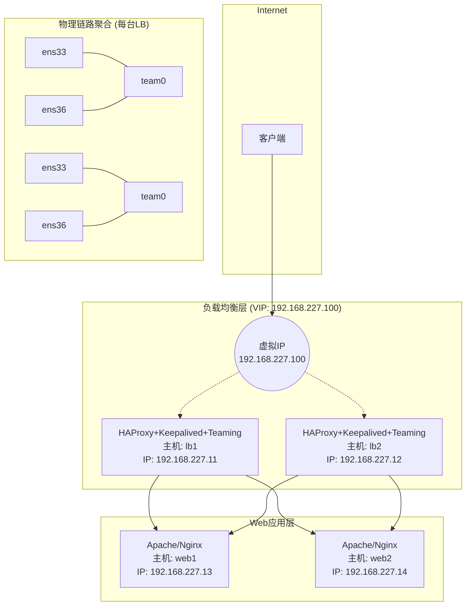

# 基于 Keepalived + HAProxy + Teaming + VRRP的高可用流量接入平台

---

## 一、系统架构



## 二、节点规划

| 主机名      | IP             | 用途      | 备注    |
| -------- | -------------- | ------- | ----- |
| lb1.com  | 192.168.227.11 | 主负载均衡   | 双网卡聚合 |
| lb2.com  | 192.168.227.12 | 备负载均衡   | 双网卡聚合 |
| web1.com | 192.168.227.13 | web服务器1 | 单网卡   |
| web2.com | 192.168.227.14 | web服务器2 | 单网卡   |

## 三、teaming实现网卡聚合

> 配置网卡聚合并启动

```bash
nmcli con add ifname team0 con-name team0 type team \
> config '{"runner":{"name":"roundrobin"}'
nmcli con modify team0 ipv4.method manual ipv4.addresses 192.168.227.11 \
> ipv4.gateway 192.168.227.2 ipv4.dns 114.114.114.114
nmcli con add con-name team0-port1 ifname ens33 type team-slave \
> master team0
nmcli con add con-name team0-port2 ifname ens36 type team-slave \
> master team0
nmcli con up team0-port1
nmcli con up team0-port2
nmcli con up team0
teamdctl team0 state
```

## 四、Haproxy实现负载均衡

> haproxy.conf

```bash
global
    daemon
    maxconn 50000

defaults
    mode http
    timeout connect 5s
    timeout client 50s
    timeout server 50s

frontend http-in
    bind *:80
    default_backend webservers

backend webservers
    balance roundrobin
    option httpchk GET /
    server web1 192.168.227.13:80 check
    server web2 192.168.227.14:80 check
```

## 五、Keepalived实现高可用

> Master的keepalived.conf

```bash
global_defs {
    router_id LVS_MASTER
}

vrrp_script chk_haproxy {
    script "/etc/keepalived/check_haproxy.sh"
    interval 2
    weight 2
}

vrrp_instance VI_1 {
    state MASTER
    interface team0          
    virtual_router_id 51
    priority 150
    advert_int 1
    virtual_ipaddress {
        192.168.227.100/24 dev team0
    }
    track_script {
        chk_haproxy
    }
}
```

> Backup的keepalived.conf

```bash
global_defs {
    router_id LVS_BACKUP
}

vrrp_script chk_haproxy {
    script "/etc/keepalived/check_haproxy.sh"
    interval 2
    weight 2
}

vrrp_instance VI_1 {
    state BACKUP
    interface team0           
    virtual_router_id 51
    priority 100
    advert_int 1
    virtual_ipaddress {
        192.168.227.100/24 dev team0
    }
    track_script {
        chk_haproxy
    }
}
```

> 编辑启动脚本

```bash
sed -i '/KillMode/d' /usr/lib/systemd/system/keepalived.service
systemctl daemon-reload
```

> keepalived测试haproxy是否宕机的脚本

```bash
#!/bin/bash
if ! pidof haproxy > /dev/null; then
    systemctl start haproxy
    sleep 1
    if ! pidof haproxy > /dev/null; then
        systemctl stop keepalived
    fi
fi
```
